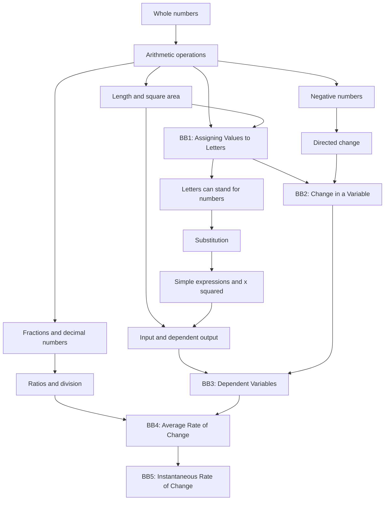

# Prerequisite Map

Status: **Draft for founder review**

This map defines what a learner should know before entering each part of *Variables and Rates of Change*. A prerequisite is included only when the lesson genuinely depends on it.

## Dependency map

## Entry nodes

| ID | Learner can… | Evidence check | Needed before |
|---|---|---|---|
| P-01 | read a number written in figures | read 1, 7 and 340 aloud | BB1 |
| P-02 | recognise negative numbers as direction or loss | place −2, 0 and 3 on a line | BB2 |
| P-03 | use decimals such as 0.5 and 2.5 | compare and subtract two decimals | BB1, BB2 |
| P-04 | understand that a letter may hold a number | evaluate `x + 1` when `x = 2` | BB2 |
| P-05 | substitute a value into a simple expression | evaluate `x²` for `x = 3` | BB3 |
| P-06 | connect side length with square area | explain why side 3 gives area 9 | BB3 |
| P-07 | read a ratio as division | interpret `6 ÷ 2 = 3 per unit` | BB4 |
| P-08 | read a length in centimetres | say which of 2 cm and 3.5 cm is longer | BB1 |

`P-04` moved from BB1 to BB2 on 2026-08-09. Under fork F-2, BB1 is where a
learner first meets a letter standing for a number, so it cannot also be assumed
beforehand. `P-01` narrowed at the same time: BB1 performs no arithmetic, it only
requires that a figure can be read. `P-08` was added because BB1 section 4 puts a
centimetre measurement on screen, a requirement the map previously carried only
as the unnumbered `G0` node.

## Diagnostic policy

The learner should receive a short diagnostic before the lesson. A missed prerequisite should open a short repair BB, not block the learner with a long preliminary course.

No repair BB will be written until this map is approved.

## Founder decision

- [ ] Prerequisite nodes are sufficient.
- [ ] Some nodes should be added, removed or reordered.
