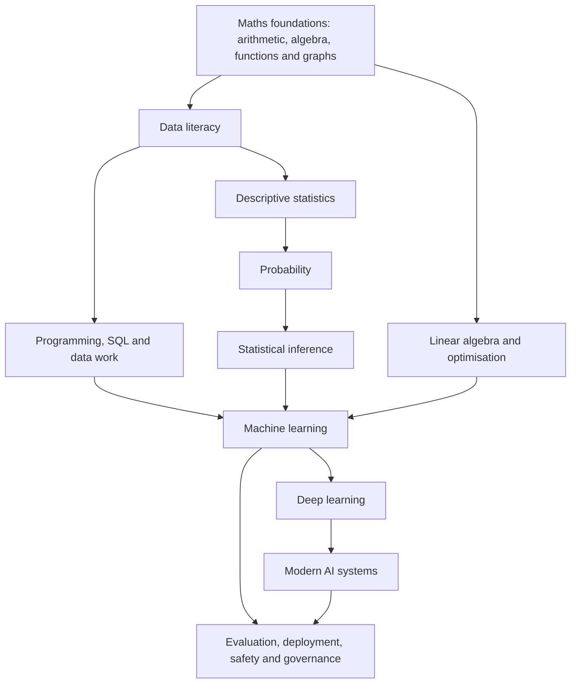

# Data Science, Machine Learning and AI Roadmap

Status: **Strategic direction recorded; dependency skeleton awaiting founder review**  
Founder direction: 2026-08-21  
Current drafting gate: `STAT-DATA-001` only

Detailed reference coverage: `curriculum/06-WIKIPEDIA-CONCEPT-ATLAS.md`
Persistent learning world: `curriculum/07-SUPERSTORE-LEARNING-WORLD.md`
Ordered learner catalogue: `curriculum/08-SUPERSTORE-TOPIC-CATALOG.md`

## Destination

Qubix is to become a deep, gamified digital learning library for Data Science,
Machine Learning and Artificial Intelligence. The existing algebra and functions
work is part of the mathematical foundation, not a separate dead end.

“Mega course” describes the destination and breadth. It is not permission to
generate the whole catalogue at once. Each board still crosses the source,
prerequisite, interaction and founder-review gates individually.

## Dependency spine

## Proposed learning pathways

| Stage | Pathway | Concepts eventually covered | Gate now |
|---:|---|---|---|
| 1 | Data literacy | observations, variables, data types, measurement, tables, missing values, data quality and provenance | Draft `STAT-DATA-001` only |
| 2 | Descriptive statistics | distributions, frequency tables, visualisation, centre, spread, quantiles, outliers and standardisation | Locked |
| 3 | Probability | sample spaces, counting, conditional probability, independence, Bayes’ rule, random variables and common distributions | Locked |
| 4 | Statistical inference | sampling, bias, sampling distributions, estimation, confidence intervals, tests, power and practical significance | Locked |
| 5 | Data work | Python, notebooks, NumPy, pandas, SQL, cleaning, joins, reshaping, reproducibility and exploratory analysis | Locked |
| 6 | Mathematical foundations for ML | vectors, matrices, linear transformations, derivatives, gradients, optimisation and numerical reasoning | Existing maths work contributes; placement locked |
| 7 | Machine learning | problem framing, train/validation/test splits, regression, classification, trees, ensembles, clustering, dimensionality reduction, feature work and evaluation | Locked |
| 8 | Deep learning | tensors, neural networks, backpropagation, convolution, sequence models, attention and transformers | Locked |
| 9 | Modern AI | embeddings, retrieval, language models, multimodal systems, agents, tool use and human evaluation | Locked |
| 10 | Responsible production | leakage, fairness, privacy, robustness, interpretability, monitoring, MLOps, security and governance | Locked |

## Experience model

The production order is ebook-first. Each topic becomes a source-recorded,
founder-reviewed ebook before an interactive board is adapted from it. The ebook
is the teaching source of record; later interactions must preserve its objective,
terminology, examples, limitations and provenance rather than inventing a second
parallel explanation.

The first generated title is *Pre-Intern 001 — What Data Is and Why People Use
It*. It remains `AI_DRAFT` and does not approve or unlock an interactive board.

Every pathway should combine:

1. a short concept board with one precise learning objective;
2. an operable visual model where the learner changes the evidence;
3. a misconception check that explains the error;
4. a mission that uses the idea in a realistic dataset or system;
5. spaced reconstruction rather than answer recognition;
6. a cumulative project whose data lineage and evaluation remain visible.

Technical charts, probability diagrams, matrices, model structures and other
exact visuals are deterministic SVG, canvas, Three.js or code-native media.
Generated raster art may support narrative scenes but may not carry technical
labels, quantities or geometry.

## First proposed sequence

Only the first row is drafted. Later rows are names and dependencies, not
permission to create their learner content.

| Order | Board | Identifier | One understanding | Depends on | State |
|---:|---|---|---|---|---|
| 1 | Observations and Variables | `STAT-DATA-001` | Rows keep cases together; columns record variables consistently | reading a small table | `AI_DRAFT`, gated |
| 2 | Categorical and Quantitative Data | `STAT-DATA-002` | Variable type determines which comparisons make sense | `STAT-DATA-001` | proposed, locked |
| 3 | Counts and Distributions | `STAT-DESC-001` | A distribution shows how often values occur | `STAT-DATA-002` | proposed, locked |
| 4 | Centre Is a Choice | `STAT-DESC-002` | Mean and median answer different questions | `STAT-DESC-001` | proposed, locked |
| 5 | Measuring Spread | `STAT-DESC-003` | Centre without variation hides the shape of data | `STAT-DESC-002` | proposed, locked |
| 6 | Chance as a Long-Run Pattern | `PROB-FOUND-001` | Repeated uncertain events can have stable frequencies | fractions, `STAT-DESC-001` | proposed, locked |

## Current review decision

The next founder review surface is `?mode=factory&bb=observations-variables`.
Nothing in this roadmap is approved or released merely because it is listed.

The companion concept atlas now maps more than 150 connected reference topics
from data literacy through production AI. It expands planning breadth without
overriding the one-board drafting and founder-selection gate.

The curriculum now takes place inside Qubix Superstore, a fictional multi-branch
retail enterprise with a persistent relational model and role progression from
a zero-knowledge Pre-Intern Candidate through analytics, engineering, science,
ML, AI, trust and Lead Data Scientist. This replaces disconnected examples with
cumulative company memory.

The Superstore catalogue enumerates 379 learning topics across 17 ordered phases.
The list is visible inside the world console and remains planning data until each
topic crosses the individual board gate.
