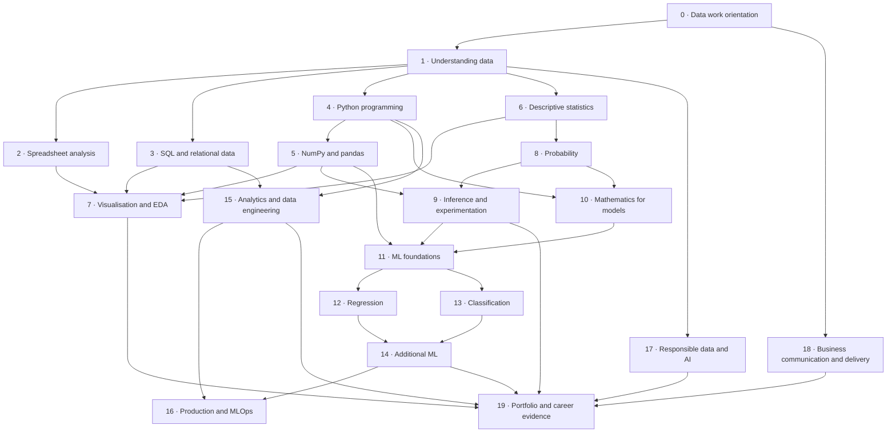

# Qubix University Curriculum Master Plan · 01 September 2026

Status: **`AI_DRAFT` · founder review required**  
Document identifier: `MASTERPLAN-01092026`  
Recorded: 2026-09-01  
Authority: the founder's explicit decisions, not the existence of this plan  
Scope: clean-slate coverage for job-ready data careers, from complete beginner
through analyst, data-science, analytics-engineering, data-engineering and
machine-learning-engineering pathways

---

## 1. Purpose

This document defines what Qubix University needs to teach before individual
learner content is drafted. It is the coverage, dependency, experience and
approval plan for the next curriculum.

It deliberately does **not** begin from the current homepage, chapters, missions
or catalogue. Existing material may later be audited against this plan and
classified as reusable, amendable, replaceable or outside scope. Nothing is
kept merely because it already exists, and nothing is deleted merely because a
new plan exists.

The plan has four purposes:

1. identify the knowledge and practical capability required by current data
   roles;
2. put those capabilities into a defensible prerequisite order;
3. define the Read/Play evidence required for every topic; and
4. give the founder a controlled route from question, to draft, to approval, to
   learner release.

The next phase after approval of this plan is content production, one Read/Play
pair at a time. This document is not permission to generate all of that content
in one pass.

---

## 2. Curriculum proposition

Qubix will prepare a complete beginner to perform defensible work with data,
explain that work to another person, and show evidence of it in a portfolio.

The shared foundation should lead first to a credible junior data-analyst exit.
From that common base, learners may continue into:

- business intelligence and analytics engineering;
- data science;
- data engineering; or
- machine-learning engineering.

The curriculum is therefore not a list of software packages. It is a progression:

```text
Understand what the data represents
                ↓
Inspect, query, clean and describe it
                ↓
Reason about uncertainty and evidence
                ↓
Build and evaluate analytical models
                ↓
Deliver reliable work for a real decision
                ↓
Specialise without losing the common standard
```

### Proposed graduate claim

> A Qubix graduate can take an unfamiliar business question and dataset,
> establish what the records mean, prepare and analyse the evidence, choose and
> validate an appropriate method, communicate a bounded conclusion, and hand
> over reproducible work.

That claim remains proposed until the founder approves it.

---

## 3. Employment evidence behind the scope

This plan uses current role descriptions as a coverage signal, not as a promise
that completing a course guarantees employment.

The recurring capabilities across reviewed descriptions are:

- SQL and relational reasoning;
- Python and data manipulation;
- Excel or spreadsheet analysis;
- statistics, experimentation and model evaluation;
- data preparation, validation and quality assurance;
- visualisation, dashboards and written explanation;
- business problem framing and stakeholder communication;
- Git, testing, documentation and reproducibility;
- data modelling, warehouses and transformation; and
- pipelines, cloud and production practices for engineering roles.

Reference signals reviewed for this plan:

- [UK Government Digital and Data Profession — Data analyst](https://ddat-capability-framework.service.gov.uk/role/data-analyst)
- [UK National Careers Service — Data scientist](https://nationalcareers.service.gov.uk/job-profiles/data-scientist)
- [O*NET — Data Scientists](https://www.onetonline.org/link/details/15-2051.00)
- [Amazon — Data and Reporting Analyst](https://www.amazon.jobs/en-gb/jobs/10432028/data-and-reporting-analyst-amxl-xloc)
- [Amazon — Business Intelligence Engineer](https://www.amazon.jobs/en/jobs/10503895/business-intelligence-engineer)
- [Amazon — Data Scientist II, London](https://www.amazon.jobs/en/jobs/10451597/data-scientist-ii-alexa-for-shopping-science-uk-alexa-for-shopping-science-uk)
- [Netlight — Analytics Engineer](https://jobs.lever.co/netlight/349c9bae-5dc1-43c0-b5f9-fe82432fc213)
- [Kitman Labs — Data Engineer](https://jobs.lever.co/kitmanlabs/af091f63-daa1-4802-bd23-df2149fe930b)
- [UK Government Digital and Data Profession — Machine learning engineer](https://ddat-capability-framework.service.gov.uk/role/machine-learning-engineer)

The employer language consistently asks for work and impact: preparing data,
writing queries and code, building reports or models, validating outputs,
communicating with stakeholders and maintaining reliable systems. Qubix
assessments must therefore test those actions rather than recognition of terms.

---

## 4. Learner entry and exits

### Entry assumption

The shared route assumes no prior data-science knowledge. It assumes only:

- ordinary reading comprehension;
- whole-number arithmetic;
- basic fractions, decimals and percentages; and
- access to a modern browser and keyboard.

Any later mathematical prerequisite must either be taught by Qubix or named
before the learner reaches it.

### Exit A · Junior data analyst

The learner can:

- inspect and clean a table;
- use spreadsheets and SQL to answer a scoped question;
- use Python, NumPy and pandas for repeatable analysis;
- apply descriptive statistics and basic inference;
- build an honest visual or dashboard;
- validate the result; and
- communicate a finding, limitation and recommendation.

### Exit B · Junior data scientist

In addition to Exit A, the learner can:

- frame prediction and inference problems;
- use probability and experimental reasoning;
- build regression and classification baselines;
- evaluate models with task-appropriate metrics;
- identify leakage, overfitting, confounding and fairness risks; and
- produce a reproducible model report.

### Exit C · Junior analytics engineer or BI engineer

In addition to Exit A, the learner can:

- model facts, dimensions and governed metrics;
- create tested SQL transformations;
- use dbt-style development practices;
- document lineage and definitions;
- connect trusted models to a BI surface; and
- work through Git and reviewable changes.

### Exit D · Junior data engineer

In addition to the shared technical core, the learner can:

- ingest files, databases and APIs;
- build repeatable ETL or ELT pipelines;
- reason about incremental loads and idempotency;
- orchestrate, test and monitor data workflows;
- use a cloud warehouse and object storage; and
- diagnose freshness, schema and quality failures.

### Exit E · Junior machine-learning engineer

In addition to Exit B, the learner can:

- convert a trained model into a testable software component;
- package and serve inference;
- use version control, tests, containers and CI/CD;
- monitor input, output and model behaviour; and
- describe rollback, retraining and human-review boundaries.

---

## 5. Curriculum architecture

The plan contains a shared job-ready foundation followed by specialist routes.
Ethics, communication, quality and reproducibility are longitudinal standards;
they are also named explicitly so they cannot disappear between technical topics.

| Phase | Pathway | Primary purpose | First relevant exit |
|---:|---|---|---|
| 0 | Data work orientation | Turn a request into a question, evidence plan and decision | All |
| 1 | Understanding data | Establish representation, grain, types, quality and provenance | All |
| 2 | Spreadsheet analysis | Perform transparent operational analysis in Excel-compatible tools | Analyst |
| 3 | SQL and relational data | Retrieve and validate evidence from related tables | All |
| 4 | Python programming | Write readable, testable analytical code | All technical exits |
| 5 | NumPy and pandas | Manipulate tabular and numerical data reproducibly | Analyst / scientist |
| 6 | Descriptive statistics | Describe shape, centre, spread and relationships | Analyst |
| 7 | Visualisation and exploratory analysis | See, investigate and communicate the evidence | Analyst |
| 8 | Probability | Reason about uncertain events and random variables | Scientist |
| 9 | Statistical inference and experimentation | Generalise cautiously and test interventions | Analyst / scientist |
| 10 | Mathematics for models | Understand vectors, derivatives, loss and optimisation | Scientist / ML engineer |
| 11 | Machine-learning foundations | Frame, split, preprocess and baseline a learning problem | Scientist |
| 12 | Regression modelling | Predict quantities and diagnose residual error | Scientist |
| 13 | Classification and decision thresholds | Evaluate decisions with asymmetric error costs | Scientist |
| 14 | Additional machine-learning methods | Compare model families and unsupervised methods | Scientist |
| 15 | Analytics and data engineering | Build governed models, transformations and pipelines | Analytics / data engineer |
| 16 | Production engineering and MLOps | Package, deploy, monitor and recover data products | Data / ML engineer |
| 17 | Responsible data and AI | Apply privacy, fairness, security and human oversight | All |
| 18 | Business communication and delivery | Translate work into decisions and durable handover | All |
| 19 | Portfolio and career evidence | Demonstrate integrated capability in reviewable projects | All |

### Dependency spine



This graph defines broad dependencies. Individual Read/Play records must still
name their exact prerequisites.

---

## 6. Complete topic coverage

### Phase 0 · Data work orientation

The learner must cover:

- the difference between a request, question, method and decision;
- stakeholders, users and decision owners;
- business processes and operational context;
- outcomes, measures and key performance indicators;
- defining scope, population, period and unit of analysis;
- evidence plans and data requirements;
- assumptions, constraints and risks;
- analytical lifecycle: question → evidence → method → validation →
  communication → action → monitoring; and
- when not to use machine learning.

Required evidence: convert an ambiguous request into an answerable question,
named decision, evidence plan and success measure.

### Phase 1 · Understanding data

The learner must cover:

- events, records and representations;
- observations, variables, rows and columns;
- structured, semi-structured and unstructured data;
- categorical and numerical data;
- nominal and ordinal categories;
- discrete and continuous quantities;
- Boolean, datetime, text and identifier fields;
- measurement scales;
- units and denominators;
- grain and level of detail;
- primary, candidate, composite and foreign keys;
- missing values, zero, unknown, pending and not applicable;
- legitimate repetition versus duplicate records;
- data provenance and lineage;
- source systems and collection processes;
- populations, samples and coverage boundaries;
- accuracy, completeness, consistency, validity, uniqueness and timeliness;
- validation rules and reconciliation; and
- data dictionaries, schemas and metadata.

Required evidence: inspect an unfamiliar table and state its grain, variables,
types, keys, units, missing-value meaning, source and limitations.

### Phase 2 · Spreadsheet analysis

The learner must cover:

- workbooks, worksheets, cells, ranges and tables;
- values versus formulas;
- relative and absolute references;
- arithmetic, comparison and logical expressions;
- `IF`, `IFS`, `SUMIFS`, `COUNTIFS`, `AVERAGEIFS` and related functions;
- text, date and error-handling functions;
- lookup functions and lookup failure modes;
- sorting, filtering and conditional formatting;
- data validation;
- cleaning and type conversion;
- pivot tables and pivot charts;
- reconciliation and control totals;
- chart creation and annotation;
- Power Query fundamentals;
- repeatable report templates; and
- spreadsheet risk, hidden logic and auditability.

Required evidence: clean and reconcile an operational extract, build a pivoted
summary and explain the controls that protect the result.

### Phase 3 · SQL and relational data

The learner must cover:

- databases, tables, schemas and relations;
- `SELECT`, aliases and calculated columns;
- `WHERE`, comparison, Boolean logic and pattern matching;
- `ORDER BY`, `LIMIT` and deterministic output;
- `CASE` expressions;
- `NULL` and three-valued logic;
- aggregates, `GROUP BY` and `HAVING`;
- inner, left, right, full and cross joins;
- one-to-one, one-to-many and many-to-many relationships;
- join cardinality, fan-out and grain change;
- subqueries and correlated subqueries;
- common table expressions;
- `UNION`, `INTERSECT` and `EXCEPT`;
- window functions, partitions and frames;
- dates, times and temporal joins;
- strings and regular transformation patterns;
- deduplication and record selection;
- validation queries and reconciliation;
- views and reusable query layers;
- indexes and query plans at an introductory level;
- transactions and data integrity fundamentals; and
- documenting query assumptions.

Required evidence: retrieve a defensible result from multiple related tables,
prove that joins did not silently change the intended population, and deliver
the query with validation checks.

### Phase 4 · Python programming

The learner must cover:

- variables, names and assignment;
- integers, floats, strings, booleans and `None`;
- lists and array concepts;
- tuples, sets and dictionaries;
- indexing, slicing and iteration;
- comparison and Boolean logic;
- conditional statements;
- loops and comprehensions;
- functions, arguments, return values and scope;
- modules, imports and the standard library;
- reading and writing files;
- exceptions and defensive handling;
- debugging and tracing;
- assertions and automated tests;
- classes and objects at a foundation level;
- notebooks versus scripts;
- virtual environments and dependencies;
- readable code, naming and documentation; and
- computational complexity at an introductory level.

Required evidence: write, test and explain a small program that validates and
transforms a business extract without hidden manual steps.

### Phase 5 · NumPy and pandas

#### NumPy

- `ndarray` purpose and construction;
- dimensions, shapes, axes and data types;
- indexing, slicing, masks and fancy indexing;
- vectorised arithmetic;
- broadcasting;
- aggregation by axis;
- reshaping, stacking and splitting;
- random generation and reproducible seeds;
- missing and non-finite numerical values;
- linear-algebra operations; and
- performance differences between arrays and Python lists.

#### pandas

- Series and DataFrames;
- importing CSV, Excel, JSON and database results;
- inspection, profiling and descriptive output;
- selecting, filtering and sorting;
- creating and transforming columns;
- missing-data inspection and treatment;
- duplicate detection and resolution;
- grouping and aggregation;
- merging, joining and concatenating;
- reshaping, pivots and melting;
- text and categorical operations;
- datetime and time-series operations;
- method chaining;
- validation and assertions;
- export and interoperability; and
- reproducible cleaning pipelines.

Required evidence: load an unfamiliar extract, profile it, clean it, join it,
validate the output and publish a reproducible notebook plus script.

### Phase 6 · Descriptive statistics

The learner must cover:

- populations, samples and parameters;
- counts, frequencies and relative frequencies;
- empirical distributions;
- cumulative distributions;
- mean, weighted mean, median and mode;
- appropriate and inappropriate uses of each measure of centre;
- minimum, maximum and range;
- quantiles, percentiles and quartiles;
- five-number summaries and interquartile range;
- variance and standard deviation;
- robust summaries;
- skewness, tails and multimodality;
- outliers and influence;
- standardisation and z-scores;
- covariance;
- Pearson correlation;
- rank correlation;
- correlation matrices;
- missingness and distorted summaries; and
- why association is not causation.

Required evidence: describe a distribution with chosen, justified summaries;
build and interpret a correlation matrix without making causal claims.

### Phase 7 · Visualisation and exploratory analysis

The learner must cover:

- analytical question before chart choice;
- tables as visual evidence;
- bar and dot charts for comparison;
- histograms and density displays for distributions;
- box plots and interval displays;
- line charts for change over time;
- scatter plots for relationships;
- heatmaps, including correlation heatmaps;
- composition and hierarchy displays;
- small multiples and faceting;
- encodings: position, length, angle, area and colour;
- scales, axes, baselines and transformations;
- labels, units, denominators, sources and periods;
- uncertainty displays;
- accessibility, colour vision and non-colour cues;
- exploratory versus explanatory visualisation;
- dashboard purpose, layout and interaction;
- Tableau, Power BI or equivalent BI fundamentals;
- anomaly and root-cause investigation; and
- narrative, annotation and honest emphasis.

Required evidence: explore a dataset, record the investigation trail, then
produce one operational view and one stakeholder explanation from the same
evidence.

### Phase 8 · Probability

The learner must cover:

- randomness and repeatable uncertain processes;
- outcomes, events and sample spaces;
- counting principles;
- probability as a proportion of a named set;
- complements, unions and intersections;
- addition and multiplication rules;
- conditional probability;
- independence and dependence;
- contingency tables and probability trees;
- base rates;
- Bayes' rule;
- discrete and continuous random variables;
- probability mass and density functions;
- cumulative distribution functions;
- expected value and variance;
- Bernoulli and binomial distributions;
- geometric distribution;
- Poisson distribution;
- uniform and normal distributions;
- sampling with and without replacement;
- law of large numbers;
- Monte Carlo simulation; and
- simulation as a check on analytical reasoning.

Required evidence: model a business event, calculate conditional and
unconditional probabilities, diagnose a base-rate mistake, and verify a result
with a reproducible simulation.

### Phase 9 · Statistical inference and experimentation

The learner must cover:

- census, sample and target population;
- random, stratified, cluster and convenience sampling;
- selection, measurement, survivorship and non-response bias;
- estimators and sampling variability;
- sampling distributions;
- central limit theorem;
- standard error;
- point estimates and interval estimates;
- confidence intervals and their correct interpretation;
- null and alternative hypotheses;
- test statistics and reference distributions;
- p-values and common misinterpretations;
- Type I and Type II errors;
- statistical power and sample size;
- effect size and practical significance;
- multiple testing at an introductory level;
- experimental units, treatments, controls and randomisation;
- A/B testing;
- observational versus experimental evidence;
- confounding and controlled comparison;
- Simpson's paradox;
- causal diagrams at an introductory level; and
- reporting uncertainty and limitations.

Required evidence: design and analyse a small experiment or quasi-experimental
investigation, report uncertainty, and separate statistical evidence from the
decision recommendation.

### Phase 10 · Mathematics for models

The learner must cover:

- algebraic expressions and equations;
- functions, inputs, outputs and composition;
- exponents and logarithms;
- sequences and indexed access;
- vectors and vector operations;
- length, direction and dot product;
- matrices, shapes and matrix operations;
- matrix multiplication and transformations;
- systems of equations;
- derivatives as local rates of change;
- partial derivatives;
- gradients;
- numerical approximation;
- objective and loss functions;
- minima, maxima and convexity intuition;
- gradient descent;
- learning rates;
- stochastic and mini-batch optimisation intuition; and
- numerical stability.

Required evidence: express a simple loss function, calculate or approximate its
gradient, and show how learning-rate choices change gradient descent.

### Phase 11 · Machine-learning foundations

The learner must cover:

- when machine learning is and is not appropriate;
- supervised, unsupervised and reinforcement-learning vocabulary;
- regression, classification, ranking, clustering and anomaly detection;
- examples, features, labels and targets;
- parameters and hyperparameters;
- training, validation and test sets;
- random and time-aware splits;
- cross-validation;
- baseline models;
- preprocessing fit boundaries;
- scaling and transformation;
- categorical encoding;
- missingness strategies;
- feature engineering;
- feature selection;
- data leakage;
- overfitting and underfitting;
- bias and variance;
- regularisation;
- pipelines;
- reproducible experiments; and
- model cards and experiment records.

Required evidence: frame a valid ML problem, create a leakage-safe baseline and
define the evaluation plan before choosing an advanced algorithm.

### Phase 12 · Regression modelling

The learner must cover:

- simple linear regression;
- multiple linear regression;
- intercepts and coefficients;
- fitted values and residuals;
- assumptions and diagnostics;
- transformations and interactions;
- multicollinearity;
- regularised linear models;
- mean absolute error;
- mean squared error;
- root mean square versus root mean squared error;
- root mean squared error;
- R-squared and adjusted R-squared;
- train/test evaluation;
- prediction intervals at an introductory level;
- logistic regression as a bridge to classification; and
- prediction versus explanation and causal interpretation.

Required evidence: fit and diagnose a regression model, compare it with a
baseline using justified metrics, and explain what its coefficients and errors
do and do not mean.

### Phase 13 · Classification and decision thresholds

The learner must cover:

- binary and multiclass classification;
- class labels, scores and probabilities;
- confusion matrices;
- true positives and true negatives;
- false positives and false negatives;
- accuracy and its failure under imbalance;
- precision and positive predictive value;
- recall, sensitivity and true-positive rate;
- specificity and false-positive rate;
- F1 and other combined measures;
- thresholds and decision costs;
- ROC curves and ROC-AUC;
- precision-recall curves and PR-AUC;
- calibration and reliability;
- class imbalance and resampling;
- cost-sensitive evaluation;
- cross-validation and uncertainty in metrics; and
- communicating the human consequence of an error.

Required evidence: evaluate a classifier, choose a threshold from stated
business costs, and explain who or what is affected by each error category.

### Phase 14 · Additional machine-learning methods

The learner must cover:

- k-nearest neighbours;
- decision trees;
- random forests;
- gradient boosting;
- naive Bayes;
- support-vector-machine intuition;
- clustering objectives;
- k-means;
- hierarchical clustering;
- dimensionality reduction;
- principal component analysis;
- anomaly detection;
- time-series decomposition and forecasting fundamentals;
- recommendation fundamentals;
- natural-language-processing foundations;
- neural-network foundations; and
- choosing model complexity according to evidence and operational need.

Required evidence: compare at least three defensible methods on the same task,
using a fixed evaluation plan and an explicit simplicity-versus-performance
decision.

### Phase 15 · Analytics and data engineering

The learner must cover:

- operational systems versus analytical systems;
- relational modelling and normalisation;
- fact and dimension tables;
- star schemas and slowly changing dimensions;
- metric definitions and semantic layers;
- data warehouses, lakes and lakehouses;
- file formats including CSV, JSON and Parquet;
- APIs and extraction;
- ETL versus ELT;
- staging, intermediate and presentation layers;
- dbt-style models, tests and documentation;
- batch and streaming concepts;
- orchestration with Airflow, Dagster or equivalent;
- full, incremental and change-data-capture loads;
- idempotency, watermarks and backfills;
- schema evolution;
- data quality, contracts and observability;
- lineage and metadata;
- warehouse performance and cost fundamentals;
- cloud object storage and compute fundamentals; and
- Snowflake, BigQuery, Redshift or Databricks concepts.

Required evidence: ingest two sources, create a tested analytical model, run it
incrementally, document lineage and demonstrate recovery from a failed load.

### Phase 16 · Production engineering and MLOps

The learner must cover:

- Git repositories, branches, commits and pull requests;
- code review;
- unit, integration and data tests;
- linting, formatting and type checking;
- configuration and secrets;
- packaging and dependency management;
- logging and structured errors;
- APIs and model-serving patterns;
- Docker and container fundamentals;
- CI/CD;
- infrastructure and cloud deployment concepts;
- model and data versioning;
- experiment tracking;
- batch versus online inference;
- feature consistency;
- performance, data and concept drift;
- monitoring, alerts and service-level expectations;
- rollback, retraining and incident response;
- security and least privilege; and
- human review and fail-safe behaviour.

Required evidence: package a small analytical or ML service, test and deploy it
through a repeatable pipeline, monitor one failure mode and demonstrate rollback.

### Phase 17 · Responsible data and AI

This phase is explicit, but its checks begin in Phase 0 and recur throughout.

The learner must cover:

- privacy and data minimisation;
- lawful, ethical and expected use;
- consent and purpose limitation;
- security, access and sensitive data;
- representational and measurement bias;
- sampling and historical bias;
- group and individual fairness concepts;
- accessibility;
- explainability and interpretability;
- uncertainty and limitations;
- model misuse and automation bias;
- documentation and audit trails;
- data retention and deletion;
- human oversight and contestability;
- responsible use of generative AI;
- environmental and operational costs; and
- governance, escalation and accountability.

Required evidence: produce a risk and controls assessment for a data product,
identify affected people, define human-review points and recommend whether the
product should proceed.

### Phase 18 · Business communication and delivery

The learner must cover:

- requirements gathering;
- stakeholder mapping;
- problem framing and scope control;
- KPIs, baselines and success measures;
- business-process understanding;
- analytical project planning;
- prioritisation and trade-offs;
- root-cause analysis;
- communicating progress, blockers and risks;
- distinguishing observation, interpretation and recommendation;
- writing analytical reports;
- presenting to technical and non-technical audiences;
- visual and verbal data storytelling;
- documenting assumptions and decisions;
- estimation of impact and value;
- asking for clarification and challenging invalid requests;
- reproducible handover;
- teamwork, feedback and review; and
- maintenance ownership after delivery.

Required evidence: deliver a concise stakeholder briefing backed by a
reproducible analysis, answer challenges, record limitations and hand the work
to another learner who can rerun it.

### Phase 19 · Portfolio and career evidence

Every learner must produce reviewable evidence rather than a completion-only
certificate.

The shared portfolio requires:

1. **Operational analysis** — a spreadsheet and SQL investigation with controls,
   visual summary and recommendation.
2. **Reproducible Python analysis** — a notebook and script using NumPy and
   pandas, with tests and a written handover.
3. **Statistics or experiment** — a sampling, interval or A/B investigation
   that reports uncertainty and practical significance.

Specialist additions:

- **Data scientist:** one regression and one classification investigation with
  baselines, diagnostics, evaluation and model card.
- **Analytics engineer:** a tested dimensional model, governed metric and BI
  output built through a reviewable transformation project.
- **Data engineer:** an orchestrated pipeline with quality checks, incremental
  behaviour, monitoring and recovery notes.
- **ML engineer:** a packaged model service with tests, deployment, monitoring
  and rollback evidence.

Career preparation must include:

- role comparison and realistic daily work;
- portfolio presentation;
- CV and project-language translation;
- explaining personal contribution;
- technical interview exercises;
- take-home-task practice;
- communicating trade-offs;
- responsible use of AI assistance; and
- a personal skills-gap and continuing-development plan.

---

## 7. Read/Play content contract

Each curriculum topic is delivered as one or more Read/Play pairs. A pair is
the minimum approval and production unit.

### Read must contain

- one precise learning objective;
- explicit prerequisites;
- standard terminology;
- a motivating business or technical question;
- a concrete example grounded in named data;
- the concept explanation;
- at least one counterexample or boundary;
- the most likely misconception;
- a retrieval check;
- a short application prompt;
- source and licence records; and
- a statement of what the lesson deliberately defers.

### Play must contain

- the same objective and terminology as Read;
- an operable task, not answer recognition alone;
- evidence that changes in response to learner action;
- a realistic error or misconception;
- explanatory feedback for incorrect work;
- at least one transfer case with changed surface details;
- an observable completion standard;
- accessibility through keyboard, touch and readable text;
- deterministic answers or an auditable evaluation rule; and
- a portfolio artefact when the topic produces workplace evidence.

### Pair completion standard

A learner completes a pair only when they can:

1. identify the relevant concept;
2. perform the required operation;
3. validate the output;
4. explain the result in context; and
5. state at least one limitation or failure condition.

Time spent, page visits and button presses are not evidence of mastery.

---

## 8. The Qubix Group learning world

The proposed default applied environment is a clearly fictional organisation
with consistent people, branches, products, suppliers, operations and systems.

The learning world should allow the same evidence to be revisited at increasing
depth:

- a beginner sees one receipt and two tables;
- an analyst sees branches, products, prices and operational metrics;
- a statistician sees populations, samples, experiments and uncertainty;
- a data scientist sees prediction targets, features and evaluation costs;
- an analytics engineer sees facts, dimensions and governed metrics;
- a data engineer sees sources, pipelines, schemas and failures; and
- an ML engineer sees packaging, serving, monitoring and human review.

Rules for the world:

- it must be labelled fictional wherever confusion is possible;
- facts used in teaching must be generated or recorded deterministically;
- lessons must not invent parallel rows when the canonical dataset can provide
  them;
- deliberate faults must be documented and guarded;
- early lessons must expose only the smallest relevant slice;
- later complexity must be earned through prerequisites;
- dataset versions must be traceable; and
- learner work must not depend on private or personal data.

Approval of this plan does not automatically approve the current Qubix Group
dataset or any lesson already built around it. The dataset receives its own
founder decision before it becomes the new curriculum's canonical world.

---

## 9. Assessment model

Assessment proceeds through four layers.

### Layer 1 · Retrieval

The learner recalls terminology, rules and interpretations without relying on
the answer being visible.

### Layer 2 · Controlled application

The learner applies one concept to a deliberately small example and receives
specific feedback.

### Layer 3 · Transfer

The learner meets changed labels, values or business context and must decide
whether the same method still applies.

### Layer 4 · Integrated workplace evidence

The learner completes a realistic investigation in which the method is not
named in advance. They must choose, validate, explain and hand over the work.

Every phase must include all four layers before it can support a job-readiness
claim. Automated scoring may support Layers 1 to 3. Layer 4 requires a rubric
and may require founder, facilitator or trained reviewer judgement.

---

## 10. Job-readiness standard

A learner is not job ready because they have encountered every topic. They must
demonstrate the following shared capabilities:

1. inspect and clean an unfamiliar dataset;
2. state grain, keys, units, missingness, provenance and limitations;
3. query a relational database with SQL;
4. analyse data with spreadsheets and Python;
5. use NumPy and pandas for reproducible transformation;
6. choose and justify descriptive statistics;
7. create an honest, accessible visual or dashboard;
8. reason about sampling, uncertainty and evidence;
9. validate results with independent checks;
10. use Git and produce reviewable work;
11. communicate a finding and recommendation to a stakeholder; and
12. hand over work another person can reproduce.

Specialist job readiness adds the evidence named in the relevant exit and
portfolio sections. No single tool badge substitutes for integrated evidence.

---

## 11. Homepage and curriculum-map requirements

The homepage curriculum must be generated from the approved master records, not
maintained as a separate hand-written selection.

It must show:

- every approved major phase;
- the exact Read/Play pairs inside each phase;
- prerequisites or locked dependencies;
- status: planned, drafting, founder review, approved or released;
- which items count toward learner progress;
- available role exits and specialisations; and
- honest treatment of unwritten or unbuilt material.

To prevent overcrowding:

- the major phases remain visible;
- individual pairs may expand progressively;
- released material is the default learner emphasis;
- planned material is visible as a roadmap but excluded from progress; and
- a founder review view exposes the complete approval queue.

The public learner view and founder review view must consume the same curriculum
source. This prevents the homepage from silently omitting Probability,
inference, evaluation or any other approved part of the route.

---

## 12. Curriculum records and status control

Every Read/Play pair must have a source record containing:

- stable identifier;
- phase and sequence;
- title using standard terminology;
- objective;
- prerequisites;
- required dataset and version;
- Read record;
- Play record;
- misconception and transfer records;
- assessment rubric;
- portfolio artefact, if any;
- references and reuse boundary;
- accessibility review;
- authoring history;
- founder notes;
- status; and
- approval and release dates when applicable.

Permitted statuses remain:

- `SOURCE_SELECTED`
- `AI_DRAFT`
- `FOUNDER_READING`
- `AMENDMENTS_REQUIRED`
- `FOUNDER_TESTING`
- `APPROVED`
- `RELEASED`

Only the founder may set `APPROVED` or `RELEASED`. Publication for testing does
not change curriculum status. `RELEASED` is not a substitute for `APPROVED`.

---

## 13. Drafting and founder-approval workflow

### Gate 0 · Coverage

The founder approves or amends this master plan and its broad dependency order.

### Gate 1 · Pair framing

Before prose or interaction work begins, the founder reviews:

- objective;
- prerequisites;
- applied question;
- required evidence;
- misconception;
- scope boundary; and
- proposed Read and Play form.

### Gate 2 · Read draft

One complete Read draft is produced with source and licence records. The founder
reads it, asks questions and requests amendments.

### Gate 3 · Play draft

The Play interaction is drafted from the reviewed Read. The founder tests the
task, feedback, transfer and completion evidence.

### Gate 4 · Pair approval

The founder explicitly approves the Read/Play pair. Approval records exact
files, version or digest, notes and date.

### Gate 5 · Release candidate

Approved material is integrated into the curriculum map and tested for:

- prerequisite reachability;
- factual and mathematical correctness;
- desktop and mobile behaviour;
- keyboard and touch access;
- readable visual scales and labels;
- progress correctness;
- dataset consistency;
- source and licence records; and
- absence of unreleased draft material.

### Gate 6 · Release

The founder authorises publication. The release record identifies the approved
pair, commit and deployment. Only after release does the next pair enter full
drafting, unless the founder explicitly changes the one-pair rule.

---

## 14. Quality rules

Every learner-facing item must satisfy these rules:

- use standard terminology;
- teach one bounded understanding at a time;
- distinguish fact, assumption, interpretation and recommendation;
- show units, denominators, population and period where relevant;
- preserve grain and lineage through transformations;
- state uncertainty and limitations;
- use deterministic technical visuals;
- avoid generated images for exact labels, quantities or geometry;
- support reduced motion where motion is non-essential;
- provide keyboard and touch operation;
- avoid colour-only meaning;
- explain errors rather than merely reject them;
- include source provenance and lawful reuse boundaries;
- test all quoted dataset claims; and
- never present AI draft material as founder-approved curriculum.

---

## 15. Proposed production sequence

No learner content is authorised by this list. It is the proposed order in
which pair framing questions should be brought to the founder.

1. From a request to a decision
2. Events and records
3. Observations, variables, rows and columns
4. Categorical and numerical data
5. Grain and units
6. Missing values and data quality
7. Keys, duplicates and provenance
8. First spreadsheet investigation
9. First SQL query
10. Filtering, grouping and validating SQL
11. Python values, collections and functions
12. NumPy arrays
13. pandas DataFrames
14. Counts and empirical distributions
15. Mean, median and mode
16. Quantiles, variance, standard deviation and IQR
17. Relationships, covariance and correlation matrices
18. What a chart is for
19. Events, sample spaces and long-run probability
20. Conditional probability and independence
21. Base rates and Bayes' rule
22. Random variables and common distributions
23. Sampling distributions and standard error
24. Confidence intervals
25. Tests, p-values, power and practical significance
26. A/B testing, confounding and causal caution
27. Vectors, matrices and dot products
28. Derivatives, gradients and loss
29. Gradient descent
30. ML problem framing, splits and baselines
31. Linear regression and residuals
32. MAE, MSE, RMSE and R-squared
33. Logistic regression
34. Confusion matrices: TP, TN, FP and FN
35. Precision, recall, specificity, F1 and thresholds
36. Trees, ensembles, clustering and reduction
37. Governed analytical models and dbt-style work
38. Pipelines, orchestration and observability
39. Packaging, deployment and monitoring
40. Integrated portfolio capstone

Each numbered item may require more than one pair after its framing is reviewed.
The list does not predetermine lesson size.

---

## 16. Measurement and programme review

Qubix must measure learning and product quality separately.

### Learning measures

- first-attempt retrieval;
- controlled-application success;
- transfer success;
- delayed reconstruction;
- capstone rubric performance;
- ability to explain and validate work; and
- portfolio completeness and reviewer quality.

### Product measures

- activation into the first pair;
- Read-to-Play transition;
- return after one and four weeks;
- completion by phase;
- retry and abandonment points;
- accessibility failures;
- technical errors; and
- learner-reported clarity and relevance.

### Employment evidence

- portfolio review outcomes;
- interview progression;
- technical-task performance;
- paid pilot feedback;
- learner role transitions; and
- employer assessment of demonstrated work.

Metrics must not be used as proof of learning unless the measure actually tests
the claimed capability.

---

## 17. Explicit exclusions from the first production cycle

The following remain in the destination but should not delay the first
job-ready analyst route:

- deep neural-network architectures;
- convolutional and sequence models;
- transformers and large language models;
- reinforcement learning;
- distributed-computing internals;
- advanced Bayesian computation;
- advanced causal inference;
- advanced optimisation proofs;
- Kubernetes administration; and
- cloud-vendor certification preparation.

They may enter later specialist plans only after their prerequisites and job
case are approved.

---

## 18. Founder decisions required

Approval should be recorded explicitly against each decision.

- [ ] Approve the graduate claim.
- [ ] Approve the complete-beginner entry assumption.
- [ ] Approve the shared foundation plus specialist-exit structure.
- [ ] Approve the twenty-phase coverage map.
- [ ] Approve the dependency spine.
- [ ] Approve the Read/Play content contract.
- [ ] Approve the four-layer assessment model.
- [ ] Approve the job-readiness evidence standard.
- [ ] Approve the fictional Qubix Group as the proposed applied world, subject
      to its own dataset review.
- [ ] Approve the homepage and founder-review-view requirements.
- [ ] Approve the one-pair drafting and approval workflow.
- [ ] Select the first pair for framing.
- [ ] Request amendments before any content drafting begins.

Founder notes:

> Add review questions, amendments and decisions here.

---

## 19. Next action after founder review

Once this master plan is approved or amended, create one framing record only:

**Proposed first pair:** `From a request to a decision`

The framing record will ask the founder to decide:

- the exact learner;
- the decision and stakeholder;
- the single objective;
- the prerequisite assumption;
- the Qubix Group scenario and data slice;
- the misconception;
- the Read form;
- the Play form;
- the completion evidence; and
- the scope deliberately deferred.

No other learner content should enter full drafting until that framing decision
is recorded.

